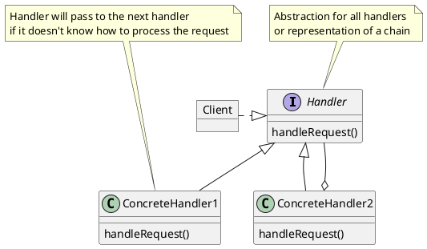

# Chain of Responsibility

### Summary
- Decouples sender and receiver
- Runtime configuration
- Hierarchical in nature
- Careful with large chains

### Concepts

- Decoupling of sender and receiver
  - send, receive without knowing who sends over
- Receiver contains reference to next receiver
- Promotes loose coupling
- No Handler - OK
- Examples:
  - java.util.logging.Logger#log()
  - javax.servlet.Filter#doFilter()
  - Spring Security Filter Chain

### Design
- Chain of receiver objects
- Handler is interface based
- ConcreteHandler for each implementation
- Each Handler has a reference to the next
- Handler, ConcreteHandler and its successor

### Pitfalls
- Handling / Handler guarantee
- Runtime configuration risk
- Chain length / performance issues

### Contrast
| Chain of Responsibility | Command                           |
|:------------------------|:----------------------------------|
| Handler is unique       | Commands are also unique          |
| Successor               | Encapsulates function             |
| Can utilize the Command | Reversible or Trackable in nature |
