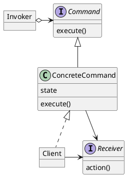

# Command

### Summary
- Encapsulates each request as an object
- Decouple sender from processor
- Very few drawbacks
- Often used for undo functionality

### Concepts
- Encapsulates request as an Object
- Object-oriented callback
- Decouple sender from processor
- Often used for "undo" functionality
- Examples:
  - java.lang.Runnable
  - javax.swing.Action

### Design
- Object per command
- Command Interface
- Execute Method (or Function)
- Rollback Method
- Reflection
- Command, Invoker, ConcreteCommand

### Pitfalls
- Dependence on other patterns
- Multiple Commands
- Make use of Memento
- Prototype for copies

### Contrast
| Command                   | Strategy                 |
|:--------------------------|:-------------------------|
| Object per command        | Object per strategy      |
| Class contains the 'what' | Class contains the 'how' |
| Encapsulates action       | Encapsulates algorithm   |
