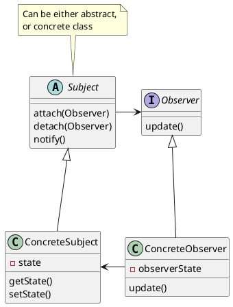

# Observer

### Concepts

- Situation where subject has one to many observers
- Decouple objects
- Pub-Sub in asynchronous fashion
- Event Handling
- M-V-C
- Examples:
  - java.util.Observer
  - java.util.EventListener

### Design

Subject (an interface, or an abstract class)
Observer
Observable
Views are Observers

