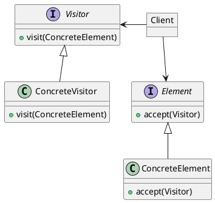

# Visitor

### Concepts

- Separate Algorithm from Object
- Adding new features
- Maintain Open/Closed principle
- Visitor changes
- Example:
  - java.lang.model.element.Element
  - java.lang.model.element.ElementVisitor

### Design
- Interface based
- Visitor and Element
- Elements have visit method
- Visitor knows every Element
- Visitor, ConcreteVisitor, Element, ConcreteElement

