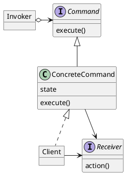

# Command

### Concepts
- Encapsulates request as an Object
- Object-oriented callback
- Decouple sender from processor
- Often used for "undo" functionality
- Examples:
  - java.lang.Runnable
  - javax.swing.Action

### Design
- Object per command
- Command Interface
- Execute Method (or Function)
- Rollback Method
- Reflection
- Command, Invoker, ConcreteCommand

