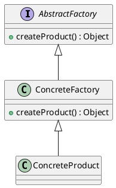

# Abstract Factory Method

Used as a factory of a factory method pattern. Consider it as a cousin
of factory pattern.

### Summary

- Group of similar Factories
- Complex
- Heavy abstraction
- Framework pattern

### Concepts

- Factory of Factories
- Factory of related objects
- Common Interface
- Defer to Subclasses
- Examples:
  - DocumentBuilder
  - Frameworks

### Design

- Groups Factories together
- Factory is responsible for lifecycle(same as factory method pattern)
- Common Interface (as AbstractFactory)
- Concrete Classes
- Parameterized create method
- Composition

### Pitfalls

- Complexity
- Runtime Switch
- Pattern within a pattern
- Problem specific
- Starts as a Factory

### Contrast

| Factorty                             | AbstractFactory            |
|:-------------------------------------|:---------------------------|
| Returns various instances            | Implemented with a Factory |
| Multiple constructors                | Hides the Factory          |
| Interface Driven                     | Abstracts Environment      |
| Adaptable to environment more easily | Built through Comparison   |

