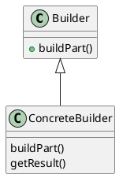

# Builder Pattern

### Summary
- Creative way to deal with complexity
- Easy to implement
- Few drawbacks

### Concepts
- Handles complex constructors
- Large number of parameters
- Force Immutability
- Examples:
  - StringBuilder
  - DocumentBuilder
  - Locale.Builder

### Design
- Flexibility over telescoping constructors
- Static inner class
- Calls appropriate constructor
- negates the need for exposed setters
- Java 1.5+ can take advantage of Generics

### Pitfalls
- Immutable
- Inner static class
- Designed first
- Complexity

### Builder vs Prototype

| Builder                      | Prototype                             |
|:-----------------------------|:--------------------------------------|
| Handles complex constructors | Implemented around a clone            |
| No interface required        | Avoids calling complex constructors   |
| Can be a separate class      | Difficult to implement in legacy code |
| Works with legacy code       | ...                                   |