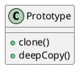

# Prototype

### Summary

- Guarantee unique instance
- Often refactored in
- Can help with performance issues
  - think about creating 100000000 instances

### Concept

- Avoids costly creation
- Avoids subclassing
- Typically, doesn't use "new"
- Often utilizes an Interface
- Usually implemented with a Registry
- Example:
  - java.lang.Object#clone()

### Design

- Clone / Cloneable
- Avoids keyword "new"
- Although a copy, each instance unique
- Costly construction not handled by client
- Can still utilize parameters for construction
- Shallow VS DeepCopy

### Pitfalls

- Sometimes not clear when to use
- Used with other patterns
  - Registry
- Shallow vs Deep Copy

| Prototype                   | Factory               |
|:----------------------------|:----------------------|
| Lighter weight construction | Flexible Objects      |
| Copy Constructor or Clone   | Multiple constructors |
| Shallow or Deep             | Concrete Instance     |
| Copy of itself              | Fresh Instance        |

