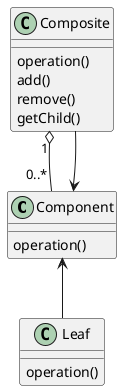

# Composite

### Summary

- Generalizes a hierarchical structure
- Can simplify things too much
- Easier for clients
- Composite != Composition

### Concept

- Components represent part or whole structure
- Compose objects into tree structures
- Individual objects treated as a composite
- Same operations applied on individual and composites
- Examples:
  - java.awt.Component
  - JSF widgets
  - RESTful service gets

### Design

- Tree structured
- Component
- Leaf or Composite, same operations
- Composite knows about child objects
- Component, Leaf, Composite

### Pitfalls

- Can overly simplify system
- Difficult to restrict
- Implementation can be costly

### Contrast

| Composite                              | Decorator                        |
|:---------------------------------------|:---------------------------------|
| Tree structure                         | Contains another entity          |
| Leaf and Composite have same interface | Modifies behavior(adds)          |
| Unity between objects                  | Doesn't change underlying object |

