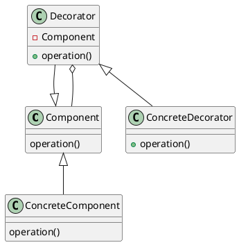

# Decorator

### Summary
- The original object can stay the same
- Unique way to add functionality
- Confused with inheritance
- Can be more complex for clients

### Concepts
- aka. wrapper
- Add behavior without affecting others
- More than just inheritance
- Single Responsibility Principle
- Compose behavior dynamically
- Examples:
  - java.io.InputStream
  - java.util.Collections#checkedList
  - UI components

### Design
- Inheritance based
- Utilizes composition and inheritance (is-a, has-a)
- Alternative to subclassing
- Constructor requires instance from hierarchy

### Pitfalls
- New class for every feature added
- Side effect:  Multiple little objects
- Often confused with simple inheritance

### Contrast
| Composite                              | Decorator                        |
|:---------------------------------------|:---------------------------------|
| Tree structure                         | Contains another entity          |
| Leaf and Composite have same interface | Modifies behavior (adds)         |
| Unity between objects                  | Doesn't change underlying object |
