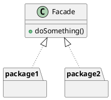

# Facade

### Summary

- Simplifies Client Interface
- Easy Pattern to implement
- Refactoring Pattern

### Concepts

- Make an API easier to use
- Reduce dependencies on outside code
- Simplify the interface or client usage
- Usually a refactoring pattern
- Examples:
  - java.net.URL
  - javax.faces.context.FacesContext

### Design

- Class that utilizes composition
- Shouldn't have a need for inheritance
- It typically encompasses full lifecycle

### Pitfalls

- It is typically used to clean up code
- Should think about API design
- Flat problem / structure
- The "Singleton" of Structural Pattern

### Contrast

| Facade                | Adapter                        |
|:----------------------|:-------------------------------|
| Simplifies Interface  | Also a refactoring pattern     |
| Works with composites | Modifies behaviour (adds)      |
| Cleaner API           | Provides a different interface |

