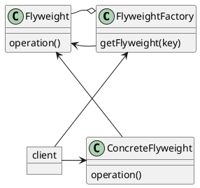

# Flyweight

### Summary

- Great for Memory Management
- A bit complex
- Used a lot for core API

### Concepts

- More efficient use of memory
- Large number of similar, immutable objects
- Most of the object states can be extrinsic
- Examples:
  - java.lang.String
  - java.lang.Integer#valueOf(int)
  - Boolean, Byte, Character, Short, Long

### Design

- Pattern of patterns
- Utilizes a Factory
- Encompasses Creation and Structure
- Client, Factory, Flyweight, ConcreteFlyweight

### Pitfalls

- Complex pattern
- Premature optimization
- Must understand Factory
- Not a graphical pattern

### Contrast

| Flyweight            | Facade                         |
|:---------------------|:-------------------------------|
| Memory Optimization  | Refactoring Pattern            |
| Optimization Pattern | Simplified Client              |
| Immutable Objects    | Provides a different interface |

